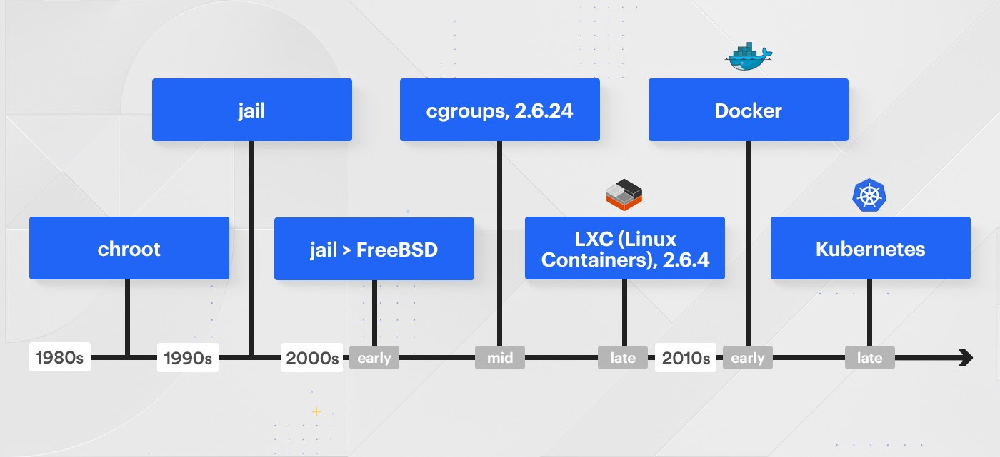
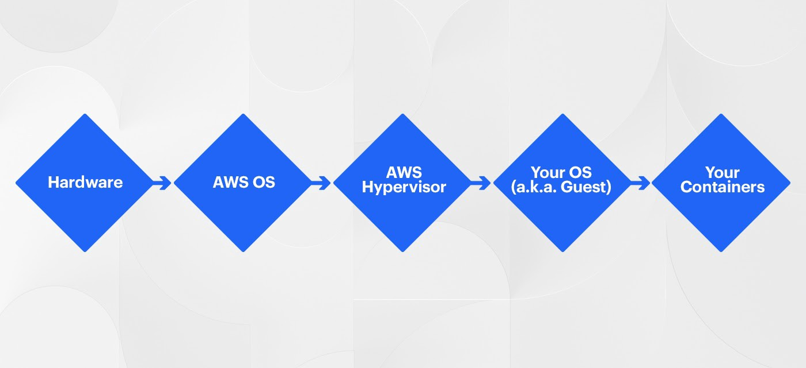
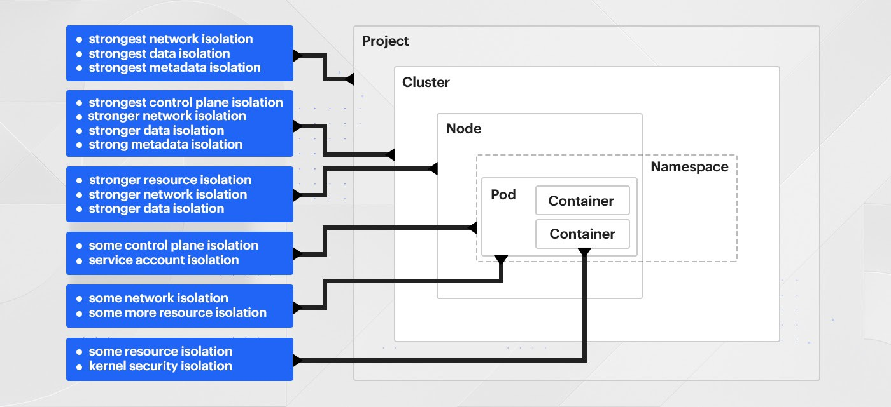
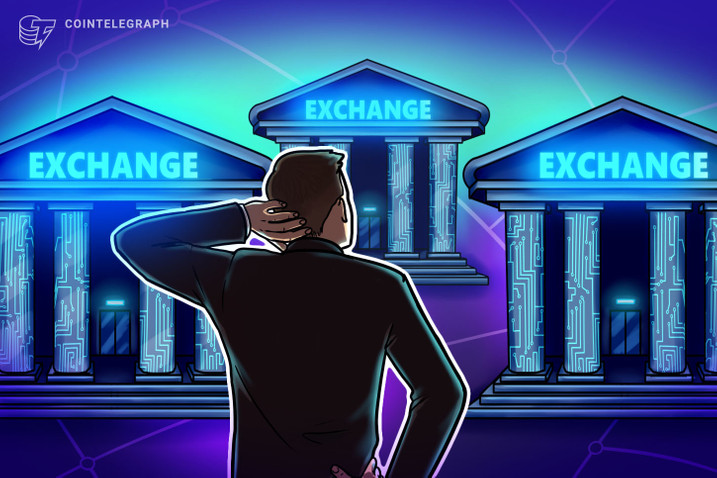
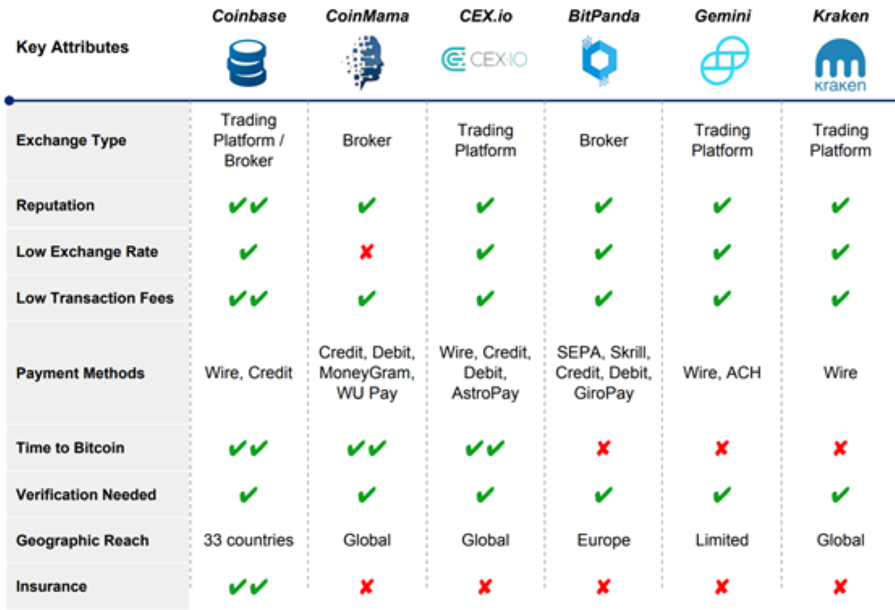

# **BLOCKCHAIN & ECONOMIC FREEDOM**

Table of Contents
 
[Introduction](#introduction)

[Overview & Origin ](#overview--origin)
        
[Business Activities](#business-activities)

[Landscape](#landscape)

[Results](#results)

[Recommendations](#recommendations)

[References](#references)

     

## Introduction
Coinbase is a global digital asset exchange company (GDAX), providing a venue to buy & sell digital currencies, as well as send information about those transactions out to the blockchain network to verify those transactions. Coinbase serves as a wallet too, where the digital currencies can be stored. 

Coinbase operates both an order book exchange, called the Global Digital Asset Exchange (GDAX), and a brokerage called Coinbase.

Advanced traders including small institutional players, like cryptoasset hedge funds and family offices, buy and sell cryptoassets on GDAX and determine the mid-market price. Coinbase then allows retail investors to buy and sell cryptoassets at these mid-market prices and charges a fee on top.

-----------

##  **Overview *&* Origin**

*  ***`NAME OF THE COMPANY:`***  **Coinbase**

* ***`WHEN WAS THE COMPNAY INCORPORATED?`***

In June 2012 in San Francisco, CA & service launched in October 2012.

* ***`WHO ARE THE FOUNDERS OF COINBASE?`***

It was founded by former Airbnb Brian Armstrong, and co-founded by Fred Ehrsam a former Goldman Sachs trader, & the blockchain.info co-founder Ben Reeves was part of the original founding team but later parted ways with Armstrong due to difference in how the Coinbase wallet should operate.

* ***`HOW DID THE IDEA FOR COINBASE COME ABOUT ?`***

> *"Digital currency will bring about more innovation, efficiency, and equality of opportunity in the world by creating an open financial system. This is our vision of the world we want to see in ten years."- Brian Armstrong*

He believed that the new technology will deeply affect us in three main ways, which are Innovations where more people will be able to reach out to the rest of the world to deliver their messages, sell their products, & market their skills. 

Efficiency where people can send & receive money within seconds globally & with a fraction of the cost that intermediates like banks, western union, & money gram charge us.

Equal opportunities where people throughout the globe will have the same equal opportunities by having access to this new technology.

* ***`HOW WAS IT FUNDED? HOW MUCH FUNDING HAVE THEY RECEIVED?`***

Coinbase raised a total of **$ 547.3M** in **9 rounds** of funding from **55 investors.**

1- **THE SEED ROUND** (Angel Investors)
 
 Was in Sep. 12th, 2012 which raised $ 600K from 7 investors; Y Combinator (YC) was one early investor.

2- **SERIES A** (Early Stage Venture) 

In May 7th, 2013 raised $ 6.1M from 8 investors in exchange with preferred stocks, among these investors are Union Square Ventures, SV Angel, Red Swan Ventures & Digital Currency Group.

3- **SERIES B** 

Took place in Dec. 13th, 2013. $ 25M were raised led by Andreessen Horowitz & joined by other 4 capital ventures.

4- **SERIES C** (late Stage Venture) 

Was in Jan 20th, 2015 Coinbase confirmed that $ 75M were raised from 15 investors like DFJ, NYSE, USAA & Strategic Banking Partners. A second series C funding took place in July 8th, 2016 led by only 3 investors Sozo Ventures, Mitsubishi UFJ Capital, & Bank of Tokyo and succeeded to raise $ 10.5M.

5- **SERIES D** 

Raised $108.1M in Aug. 10th, 2017 from 13 investors

6- **SERIES E** 

Closed funding deal with $ 300M led by Tiger Global Management in Oct 30th, 2018. 

7- In Dec. of the same year Coinbase initiated $ 50M Secondary Market sale of company stock.

--------------------------

## BUSINESS ACTIVITIES

* ***`WHAT SPECIFIC FINANCIAL PROBLEM IS COINBASE TRYING TO SOLVE?`***

Coinbase is trying to create a global Decentralized Financial system ***(DeFi)*** that is not controlled by one country or company, a system that will bring about more economic freedom, innovation, efficiency, and lift billions out of poverty.

According to “Failure by Design: The Story behind America’s Broken Economy” Book by Josh Bivens published in 2011, that between 2000 & 2007 the average incomes in the US grew by $ 1,400, all growth went to the richest 10%, & income for the bottom declined 90%.

As Josh Bivens Said:
> “We designed an economy over the past 30 years to funnel lots of money to the very rich and it worked, the good news there is the policy works, it does what is actually designed to do, if the bad news is we designed it to do in my view a very bad thing, & we need to change where policy is orientated"

Now for the first time we can have the opportunity to achieve economic freedom, digital currencies can fulfill our economic system shortfalls by:
+ It will make it easier to start a business
+ It enforces property rights
+ It promotes free trade & globalization
+ It enables freedom of contract
+ It encourages people to leave low scoring countries
+ It reduces corruption & bribery
+ It provides access to stable currency

>*"If we can create more economic freedom in the world, it will serve as a giant economic stimulus package for the world."*

* ***`WHO IS THE COMPANY INTENDED CUSTOMER?  IS THERE ANY INFORMATION ABOUT THE MARKET SIZE OF THIS SET OF CUSTOMERS?`***

Coinbase exchanges cryptocurrencies as well as other digital assets with fiat currencies in 32 countries & soon launching business in Japan. According to its website, Coinbase has served over 30M customers and facilitated the exchange of more than $150B worth of digital currency. 

Even though Coinbase might look  "like Crypto-broker app targeting retail investor; the company succeeded in expanding its base to include mix of ventures & corporate investments, & banks. In addition to the app that we all use, Coinbase has 3 sub-organizations that targets different clientele:

    Coinbase Ventures
    Coinbase Asset Management
    Coinbase Custody
 

In Nov. 2019,  coinbase announced that a new customer segmentation called “CUSTODY” will be launched early this year, Custody provides financial controls and storage solutions for institutional investors to trade cryptoassets. The service is geared toward larger players on Wall Street and costs $100,000 in initial setup fees, a management fee of 10 basis points monthly on AUM, and a minimum balance of $10M.

In April 2017, Coinbase launched “TOSHI”, which is a mobile app for browsing decentralized applications, an Ethereum wallet, and an identity and reputation management system. At a high level, the aim with Toshi is to give users broader access to decentralized applications built on top of the Ethereum blockchain. 

* ***`WHAT SOLUTIONS DOES COINBASE OFFER THAT THEIR COMPETITORS DON'T OFFER? WHAT IS THE UNFAIR ADVANTAGE THEY UTILIZE?`***

**CONTINUOUS LEARNING:** 

Coinbase sees every situation as an opportunity to learn, it has a unique feature where you can get rewarded by cryptocurrency for watching videos and correctly answer a small quiz following each section. It’s a great way to start investing in digital coins without breaking your bank.

**LIQUIDITY:** 

Coinbase buys cryptoassets from GDAX, instead of from an outside exchange. This gives the company a secure in-house source of liquidity that doesn’t have to rely on anyone else for liquidity.

**SECURITY:** 

The company has operated since 2012 and has never been hacked, establishing significant trust with consumers. Investments and funds are held and insured by Coinbase, with the majority of cryptoassets stored offline in cold storage vaults, and the remainder insured by Lloyd’s of London. Funds held in USD wallets on Coinbase are covered by the FDIC and insured up to $250,000.

**REGULATORY COMPLIANCE:** 

Coinbase is one of a few companies to hold a New York Virtual Currency License, or “Bit License” and has made a point of complying with state-by-state money transmission laws.

Note: A common critique of the Bit License is its prohibitive cost; over ten companies moved their headquarters from New York to other locales in 2015 after the license was announced.

**LAW ENFORCEMENT:** 

Coinbase has cooperated heavily with law enforcement. Coinbase follows strict identity verification procedures to comply with regulations like KYC (Know Your Customer) and AML (anti-money laundering), and to track and monitor cryptoassets sent to and from its site.

In addition to its wallet and exchange services, Coinbase offers an API that developers and merchants can use to build applications and accept bitcoin payments.

* ***`WHICH TECHNOLOGIES COINBASE IS CURRENTLY USING? HOW THEY ARE IMPLEMENTING THEM?`***

**Coinbase is actively using 63 technologies for its website but before jumping into the current day, it is important to understand the technologies that led us here:**

• 1980s: chroot

• 1990s: jail

• 2000s (early): jail > FreeBSD

• 2000s (mid): cgroups, 2.6.24

• 2000s (late): LXC (Linux Containers), 2.6.4

• 2010s (early): Docker

• 2010s (late): Kubernetes

Coinbase choose to containerize their applications to increase engineering output/developer productivity in a quick, safe, and reliable manner. Containerizing is a choice made vs. building images, although containers can sometimes be built into images, but that is out of scope (ref).

Containers enable engineers to develop, test, and run their applications locally in the same or similar manner that they will run in other environments (staging and production). 

Containers enable bundling of dependencies to be articulated and explicit vs. implied (the OS will always contain package $foo that my service depends on). Containers allow for more discreet service encapsulation and resource definition (using X CPUs and Y GB of Memory). 

Containers inherently enable you to think about scaling your application horizontally vs. vertically, resulting in more robust architectural decisions.
Some of these points could be argued in great detail. These are purposely bold and a bit over-extended to move the conversation forward as this isn’t a discussion of the pros/cons of containerization or service-ification (i.e. the breakdown of monolithic applications to a proliferation of more discreet services that run separately).

**Virtualization**

Virtualization is the concept of being able to run multiple containers on an OS virtualized system. Containers can only see the devices/resources granted to it. On a managed compute platform such as AWS you are actually running below a Hypervisor which manages the VMs that your OS and resulting containers run within.

Virtualization enables the world of containers today. Without the ability to virtualize, hardware resources running multiple applications in containers wouldn’t be possible today.

Coinbase container orchestration platform is Odin + AWS ASGs (auto-scaling groups). When you click Deploy from Codeflow (our internal UI for deployments), Odin is invoked with an API call from Codeflow. Odin kicks off a step function and begins to deploy your application. New VMs are stood up in AWS and loaded into a new ASG, your software is fetched from various internal locations, a load balancer starts health-checking these new instances, and eventually traffic is cut over in a Blue/Green manner to the new hosts in the new ASG behind the load balancer.

Products that make up Coinbase’s tech stack include: Android Wear SDK, Authy, Bootstrap, Busnag, Cloudinary, CloudFlare, DigiCert, Emailage, Evident. io, Fastly, Google (Cloud Messaging, Maps), HackerOne, Iron. io Enterprise, IronMQ, JavaScript, MarkMonitor Domain Management, MongoDB, New Relic, nginx, Node.js, PostgreSQL, Redis, Ruby, Ruby on Rails, reCAPTCHA, and Sakurity.
Additionally, here’s a list of other software products that Coinbase is using internally:

+ Marketing: Amazon SES, Google (Apps for Work, Tag Manager), Segment
+ Sales and Support: Base CRM, Olark, Salesforce Desk. com
+ Analytics: AWS Kinesis, D3js, Google Analytics, Mixpanel
+ HR: AngelList Jobs, Culture Amp, Greenhouse
+ Finance and Accounting: Emburse, BlockCypher, Sift Science, Square
+ Productivity: Clerky, FireEye, Google (Drive, Fit SDK), Managed By Q

**Clusters**

Cluster master (API) servers are a secondary control plane (besides the AWS one). Service accounts and access scopes, which containers can assume to access resources both within and outside the cluster.

**Nodes**

The operating system of the underlying, nodes must be maintained much as we do today. In fact, our OS is very similar to the base OS Google uses for GKE. 

**Pods**

Creation of pods in the cluster, and the rules about what standards they have to meet to be created, are accomplished through Pod Security Policy, 
Pods are segmented from each other through networking policies, But in the world of Kubernetes, identity, authentication, and authorization of pods to communicate with each other involve a number of supporting technologies, such as SPIFFE and SPIRE for identity format and attestation below the node level, Envoy for authorization gating, Istio for auth N and Z orchestration, and OPA for authorization policy. Each of these is a significant effort to standardize and adopt.

**Containers**

Containers are not security boundaries, they’re resource boundaries. In order to define security boundaries around containers, you need to delve into custom kernel namespaces, syscall filtering, mandatory access control frameworks, and/or vm-based isolation technologies designed for containers like gVisor.

----------------------
## Landscape

* ***`WHAT DOMAIN OF THE FINANCIAL INDUSTRY IS COINBASE IN?`***

        Blockchain & Cryptocurrencies

* ***`WHAT HAVE BEEN THE MAJOR TRENDS & INNOVATIONS OF THIS DOMIAN OVER THE LAST 5-10 YEARS?`***

Since Satoshi Nakamoto invented Bitcoin and brought blockchain technology to the world in 2009, and the new technology is raising and adopted in upscale trend.

A few years after the release of Bitcoin, developers began to see the far-reaching potential of Blockchain and began to explore its uses outside of the cryptocurrency realm. Before this, blockchain and Bitcoin were often thought of as the same thing, when in reality, Bitcoin is simply a currency built with Blockchain.

This realization spurred huge investment and research into blockchain and around 2014, attempts to repurpose the blockchain for use in applications for healthcare, insurance, supply chains, voting, and more began in earnest. As of 2017, around 15% of all banks were using blockchain technology in some capacity.

*SMART CONTRACTS*

In 2013 Vitalik Buterin founded Ethereum; unlike Bitcoin, to be a platform not just a cryptocurrency it can be used to build decentralized blockchain applications. 
He included a feature known as ‘smart contracts’, which uses the blockchain to exchange anything of value directly, without any middlemen. 

Ethereum smart contracts allow other assets, like bonds, loans, products or services, to be exchanged. During an exchange, they hold these assets in escrow until a predetermined set of criteria are met before releasing them to both parties.
Smart contracts are increasingly being used by huge corporations, such as Microsoft and UBS, to cut down on costs and save time.

*PROOF OF STACK MINING*

The next big shift in the way blockchain technology is used came when developers of cryptocurrencies like Ethereum moved away from proof of work mining in favor of proof of stake mining.
Mining is done via computer power in a proof of work system; while proof of stake seeks to improve upon issues of cost and energy consumption identified in the proof of work model by attributing mining power based on stake as opposed to computational power.

*ALTCOINS*

There are more than 5,098 alternative cryptocurrencies and over 20,000 different types of markets over the course of 11 years since Bitcoin was invented. Even though a significant number of cryptocurrency are dead, but that’s not stopping developers from creating altcoins, The top ten during the last month of 2013 included BTC, LTC, XRP, PPC, NMC, MEC, FTC, WDC, XPM, FRC, and NVC. The top ten list today, in February 2019 includes BTC, ETH, XRP, BCH, BSV, LTC, EOS, USDT, BNB, and XTZ.

*FORKS*

Are the constant updates to fix issues or increase performance & since blockchain is decentralized, nodes must adhere to the same protocol to be able to work together properly. Fork happens when there is a fundamental change in cryptocurrency protocol that may result in the birth of new cryptocurrency like Ethereum and Ethereum Classic
This case is called HARD FORK, meaning that there’s a disagreement within the community about the upgrade, the protocol is usually forked into 2 incompatible blockchains & 2 different cryptocurrencies.
SOFT FORK on the other hand, is a change in a cryptocurrency protocol which is backward-compatible, that means that non-updated nodes are still able to process transactions and push new blocks to the blockchain, so long as they don’t break the new protocol rules. 

*COVID-19 & DeFi*

This pandemic exposed the failure of our financial system & revealed the general lack of connectivity & data exchange built into our global system. The coronavirus outbreak freezes 29% of US economy. Of course, no one could have foreseen the unprecedented upheaval caused by the novel coronavirus pandemic which has disrupted and dislocated economies and ecosystems across the planet, but COVID-19 has brought supply chains & retailers to their knees while online retailers like Amazon emerged as one of the biggest winners of the coronavirus with revenues of $ 75.4B in the first 3 month of the year, which is over $33M / Hour.

Believed it or not but Early drafts of the Stimulus Bill proposed by the House of Representatives in response to COVID-19 reportedly included references to using a means of distributing “digital dollars” as aid to those impacted by this pandemic.
The shift in thinking by governments and regulators, coupled with changes in the way we source and distribute funds, gives prominence to another development. The Decentralized Finance DeFi promises a global, open alternative to traditional financial services including lending, saving, trading and insurance. 

***The goal of DeFi is to make these services accessible to anyone in the world who has a smartphone and an internet connection.***

* ***`WHAT ARE THE OTHER MAJOR COMPANIES IN THIS DOMAIN?`***

        Bitstamp 
        Bitfinex  
        Bitflyer
        Investing.com 
        Binance
        Gemini

------------------------
## **Results**

* ***`WHAT HAS BEEN THE BUSINESS IMPACT OF COINBASE SO FAR?`***

Coinbase is known for being the most popular platform to exchange fiat with crypto, one of the pioneers in crypto-trading but what makes it stand out from other crypto platforms is that Brian has a long-term view for his company, he foresees the future of Coinbase looks something like the “New York Stock Exchange” for crypto.

While some companies started to create their own tokens already, in the near future it will become standard for all companies to have their tokens & Coinbase plans to host this tokenized future, hundreds of tokens will be created within years and millions in the future and this is way larger than financial institutions like the New York Stock Exchange which is in  fact one of Coinbase investors.

* ***`WHAT ARE SOME OF THE CORE METRICS THAT COMPANIES IN THIS DOMAIN USE TO MEASURE SUCCESS? HOW IS COINBASE PERFORMANCE?`***

**1. KYC/AML**

Different exchanges comply with different laws and regulations, based on their locations, practices and offerings. Some exchanges have Know Your Customer (KYC) and Anti-Money Laundering (AML) practices, requiring participants to submit personal information about themselves during account creation. These practices and requirements vary from exchange to exchange. Some platforms require KYC and AML to withdraw funds or lift certain limitations, obligating customers to provide copies of photo identification and sometimes a proof or residence. Other platforms require such customer verification during the process of account creation.

**2. Reputation**

Since the cryptocurrency space is still largely a new industry, it is important to be aware of the reputation of each exchange of interest. Many exchanges have been involved in nefarious activities, hacks and exit scams, leaving users in a less than ideal situation.

**3. Security**

Each exchange has its own chosen methods of security. Check to see if the exchange offers two-factor authentication (2FA). If not, then the exchange may not be acceptable by security today’s standards. Additionally, look to see what type of 2FA is compatible. Google authenticator, Authy and Yubikey are three common avenues for 2FA as they arguably offer better security than mobile text-based 2FA.

Each exchange also has various other security measures possibly worth checking into, such as cold storage asset reserves and custodial storage services.

**4. Insurance fund**

Users can also note whether or not their exchange of interest has an insurance fund. Certain exchanges have funds in place to compensate customers under specific circumstances.
Other exchanges are covered under the Federal Deposit Insurance Corporation (FDIC), which can protect a specified amount of U.S. users’ funds.

**5. Fiat exchange**

Traders and investors at some point in their careers likely will require a fiat compatible exchange, allowing them to transfer national currencies (USD, CAD, etc.) into the crypto world for trading use, and out of the crypto world to cash out profits.

Some exchanges have different fiat options, compatible with specific banks, and some do not. Checking to see which banks exchanges work with, as well as what types of fiat currencies are tradable, may be necessary.

**6.Leverage trading**

Derivatives exchanges frequently offer leverage trading. Leverage essentially allows traders to borrow a certain amount of funds for trades, based on the amount of funds they hold on the exchange.

Leverage may be important for traders looking to enter short-term positions with larger size. Multiple exchanges offer anywhere from 1x to 100x leverage, although different platforms may have varying rules regarding liquidation levels and margin calls.

**7. Volume**

Trading platforms vary based on the number of participants using them at any given time, as well as the amount of each asset being traded. This aspect can be important as it affects how easily users can enter or exit positions.

If a trader is looking to sell 100 BTC, he or she likely will not be able to do so on a low-volume exchange as not enough sellers may exist at the current listed market price, forcing the trader to sell to lower offers on the exchange.

Volume issues often complicate altcoin positions on certain exchanges, making it difficult to buy or sell large amounts of those assets.

Checking volume can be a difficult task sometimes, due to exchanges posting fake volume. One method involves looking at the order book on different exchanges, taking note of what amounts of each asset sit in the order book and how far the price levels are from one another.

**8- Prices**

Asset prices also vary across multiple exchanges. Crypto assets might trade higher or lower on one exchange versus another due to participant location (China-based exchanges can sometimes pump more), volume and other factors. Noting these discrepancies can factor into choosing an exchange, especially when altcoins are concerned.

Price discrepancy can also be a red flag that a given exchange may suffer from low liquidity/volume.

**9. Asset selection**

Top digital assets such as Bitcoin, Ethereum (ETH) and Litecoin (LTC) are widely available on most crypto exchanges. Other smaller cap coins and tokens, however, may not be available on certain exchanges.

**10- Fees**

Most exchanges charge a small fee for each trade. These fees vary based on the platform, and are usually based on a percentage of each trade. Fees may not be as important to investors as they are to traders. Traders buy and sell more frequently, racking up fees more often, although this depends on the size of each trade versus investment sizing.

* ***`HOW IS COINBASE PERFORMING RELATIVE TO COMPETITORS IN THE SAME DOMAIN?`***

-------------------------------
## Recommendations

* ***`IF YOU WERE TO ADVISE THE COMPANY, WHAT PRODUCTS OR SERVICE WOULD YOU SUGGEST THEY OFFER?`***

1- BID/ASK FEATURE: is the difference between the highest price that a buyer is willing to pay for an asset and the lowest price that a seller is willing to accept. Coinbase don't allow traders to set a target price for buying or selling transactions, placing orde

2- PROVIDNIG DIFFERENT CHARTS & INDICATORS: Coinbase app supports the traditional line charts only to reflect historical and current market price, intercative charts that gives you the ability to predict future price using historical data and digital currency performance are essentials tools for any trader like candles charts, Ichimoku cloud indictor & time frame to zoom in or out on a given time interval.

3- SPEED OF PRICE SIGNAL: Coinbase needs to speed up its price indictors; the difference between the app price and the current market price hasn't excced one dollar and some change per currency but that would make a difference in large volume transactions especially after adding the fees on the top on it.

4- TRAILING STOP OREDER:  it is designed to protect gains by enabling a trade to remain open and continue to profit as long as the price is moving in the investor’s favor. The order closes the trade if the price changes direction by a specified percentage or dollar amount.

* ***`WHY DO YOU THINK THAT OFFERING THIS PRODUCT OR SERVICE WOULD YOU SUGGEST THEY OFFER?`***

Coinbase leverage investors with the major competitive edge among all other trading platforms interms of security and liquidity, adding these essential features gives investors:

        1- A comprehensive insight to determine their position in market 
        2- The ability to understand current trend & to predict the next one.
        3- Full control over their digital currencies.

* ***`WHAT TECHNOLOGIES WOULD THIS ADDITIONAL FEATURE SERVICE UTILIZE?`***

*Data visualization is the graphic representation of data. It's a technique used to display data in different forms like graphs, tables, & charts*

1. TABLEAU: It is particularly well suited to handling the huge and very fast-changing datasets which are used in Big Data operations, including artificial intelligence and machine learning applications
2. QLIKVIEW: It offers powerful business intelligence, analytics and enterprise reporting capabilities. Qlikview is commonly used alongside its sister package, Qliksense, which handles data exploration and discovery.
3. FUSION CHARTS: It's Qlikview is commonly used alongside its sister package, Qliksense, which handles data exploration and discovery.
4. HIGH CHARTS: it focus on cross-browser support, meaning anyone can view and run its interactive visualizations, which is not always true with newer platforms.
5. DATA WRAPPER: Is to create charts and present statistics. It has a simple, clear interface that makes it very easy to upload csv data and create straightforward charts, and also maps, that can quickly be embedded into reports.
6. PLOTLY: It enables more complex and sophisticated visualizations, it integrates with Python, R, & Matlab. It's commercial package adds layers of user-friendliness and support as well as inbuilt support for APIs such as Salesforce.
7. SISENSE: It provides a full stack analytics platform but its visualization capabilities provide a simple-to-use drag and drop interface which allow charts and more complex graphics, as well as interactive visualizations, to be created with a minimum of hassle. 

* ***`WHY ARE THESE TECHNOLOGIES APPROPRIATE FOR YOUR SOLUTION?`***

Beacsue when complex data vizulation is added to to the flow of raw data, it will be much easier for users to make confident decisions. It is a very useful tool for data cleaning, exploring data structure, detecting outliners, identifying trends & clusters, spotting patterns, & presenting results.

-----------------------------------------------------------------
## REFERENCES

1. [Coinbase] ( https://en.wikipedia.org/wiki/Coinbase)
2. [CB INSIGHTS] ( https://www.cbinsights.com/research/report/coinbase-strategy-teardown/#coinbase)
3. [FORBES] (4.https://www.forbes.com/sites/michaeldelcastillo/2020/02/19/blockchain-50/#9d5cf8a7553d)
4. [COINBASE BLOG] ( https://blog.coinbase.com/the-vision-mission-and-strategy-for-coinbase-944b79a64a7c)
5. [COINBASE FUNDING]  (https://blog.coinbase.com/coinbase-raises-series-e-round-of-financing-to-accelerate-the-adoption-of-cryptocurrencies-1ad927463814)
6. [CRUNCH BASE] ( https://www.crunchbase.com/organization/coinbase)
7. [TECHINASIA] ( https://www.techinasia.com/singapores-gic-invest-coinbase)
8. [DOWN DETECTOR] ( https://downdetector.com/status/coinbase/news/316590-problems-at-coinbase/)
9. [INVESTOPEDIA] ( https://www.investopedia.com/tech/coinbase-what-it-and-how-do-you-use-it/)
10. [QUORA] ( https://www.quora.com/What-is-Coinbases-technology-stack)
11. [COINBASE TECHNOLOGY] ( https://blog.coinbase.com/container-technologies-at-coinbase-d4ae118dcb6c)
12. [HISTOTY] (https://www.tradefinanceglobal.com/blockchain/history-of-blockchain/#:~:text=The%20Invention%20of%20Bitcoin,as%20a%20medium%20of%20exchange.)
13. [BRAIN ARMSTRONG] ( https://www.youtube.com/watch?v=Rp_6xbp7NQU)
14. [COVID-19 FACTS] (https://usafacts.org/articles/covid-19-impact-economy-us-retail-sales-fall-87-march/?utm_source=google&utm_medium=cpc&utm_campaign=ND-COVID&gclid=Cj0KCQjwoaz3BRDnARIsAF1RfLfzJLs2NrcrgY_lut33FzUCMnR-czwFZR0EAUMIc2BMzx7_Hwl7LH4aAgFLEALw_wcB)
15. [JOSH BIVENS INTERVIEW] (https://www.youtube.com/watch?time_continue=21&v=yqZ_KJulxUM&feature=emb_logo)
16. ["FAILURE BY DESIGN: THE STORY BEHIND AMERICA'S BROKEN ECONOMY" BOOK] (https://www.amazon.com/dp/B004RCNSII/ref=dp-kindle-redirect?_encoding=UTF8&btkr=1)
17. [COINBASE CASE STUDY BY AMAZON] (https://aws.amazon.com/solutions/case-studies/coinbase/)
18. [FORKS] (https://academy.binance.com/blockchain/hard-forks-and-soft-forks)
19. [FORM D-EQUITY] (https://www.sec.gov/Archives/edgar/data/1576711/000157671113000001/xslFormDX01/primary_doc.xml)

    